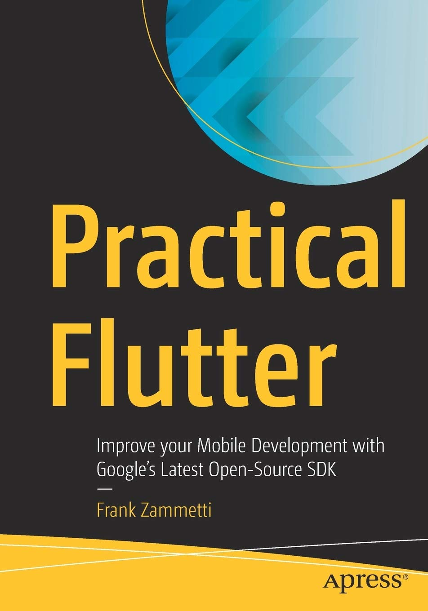
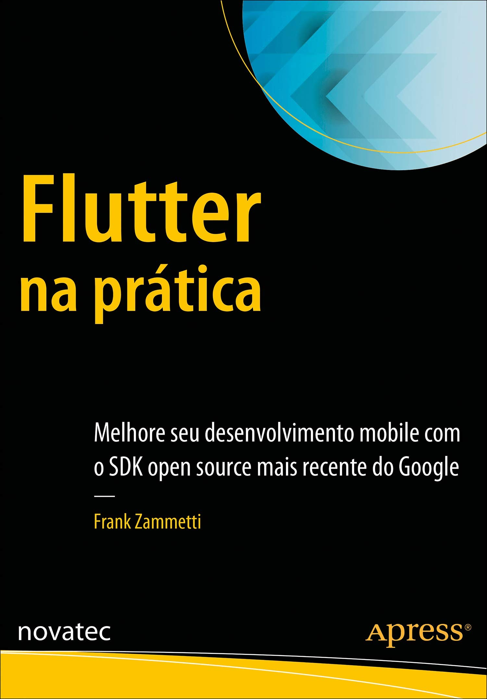

# Desenvolvimento Mobile

Prof. Eduardo Ono

 

## Descrição

 

## Conteúdo Programático

 | Aula | Data | Conteúdo |
 | :-:  | ---  | ---      |
 | 01 | 30/04 | Introdução ao Desenvolvimentoo Mobile; Flutter SDK; Configuração do Ambiente de Desenvolvimento; Aplicação "Hello World" em Dart e Flutter
 | 02 | 07/05 | Aplicação "IMC" em Flutter
 | 03 | 14/05 | "Jogo da Velha" em Flutter
 | 04 | 21/05 |
 | 05 | 28/05 |
 | -- | 04/06 | 2a. Avaliação (a ser confirmado)

 

## Vídeos Recomendados

* [TED] [Linus Torvalds, The Mind Behind Linux](https://www.youtube.com/watch?v=o8NPllzkFhE) (YouTube, 21:30)

 

## Bibliografia

| Capa | Descrição |
| :-:  | --- |
|  | [ZAMMETTI_2019]   ZAMMETTI, Frank; **Practical Flutter - Improve your Mobile Development with Google's Latest Open-Source SDK**, Apress, 2019[.](https://app.box.com/s/12e9ajfceiv9n29ojq81bqegrac87fp9)
|  | [ZAMMETTI_2020]  ZAMMETTI, Frank; **Flutter na Prática: Melhore seu Desenvolvimento Mobile com o SDK Open Source Mais Recente do Google**, Novatec Editora, 2020.

 

## Bibliografia Complementar

 

## Filmes e Documentários Recomendados

 
