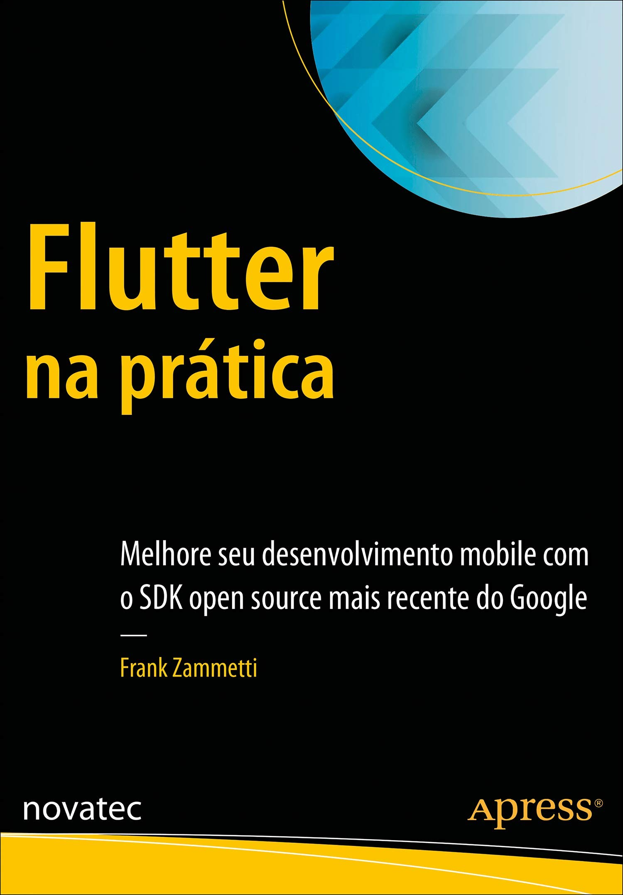
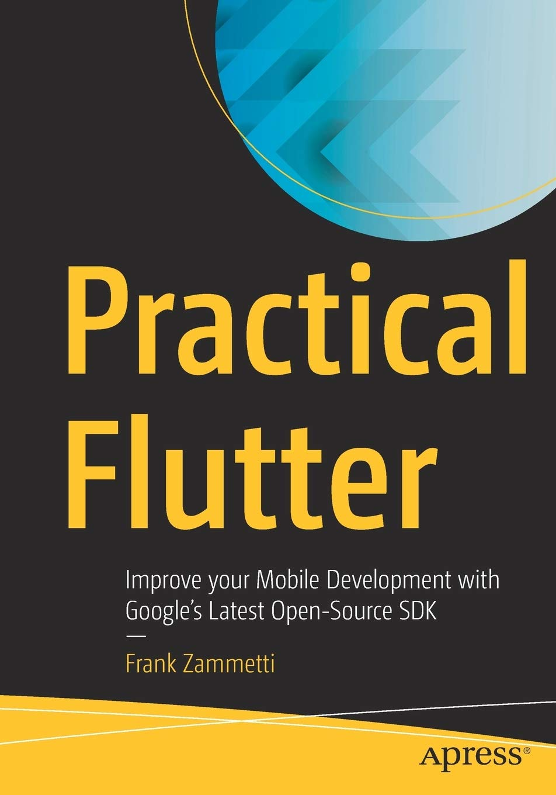
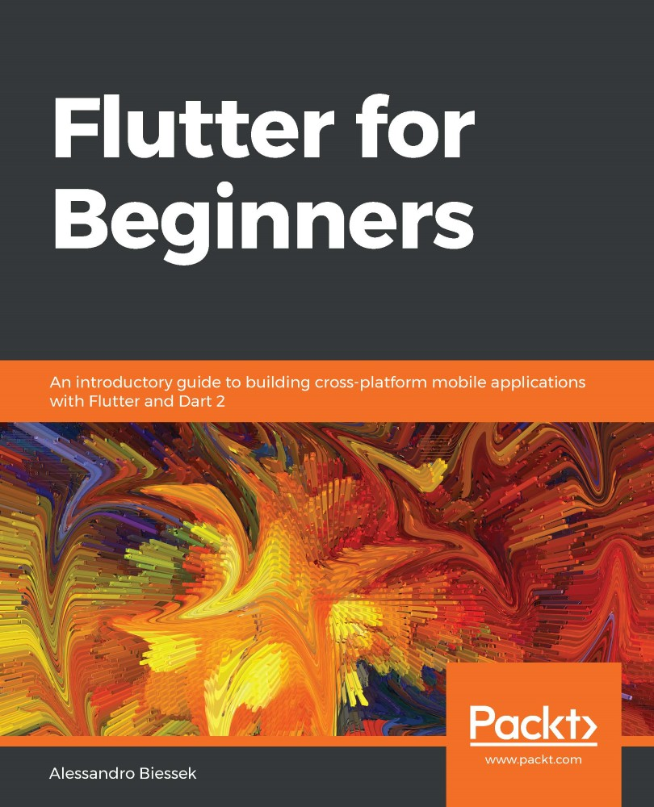
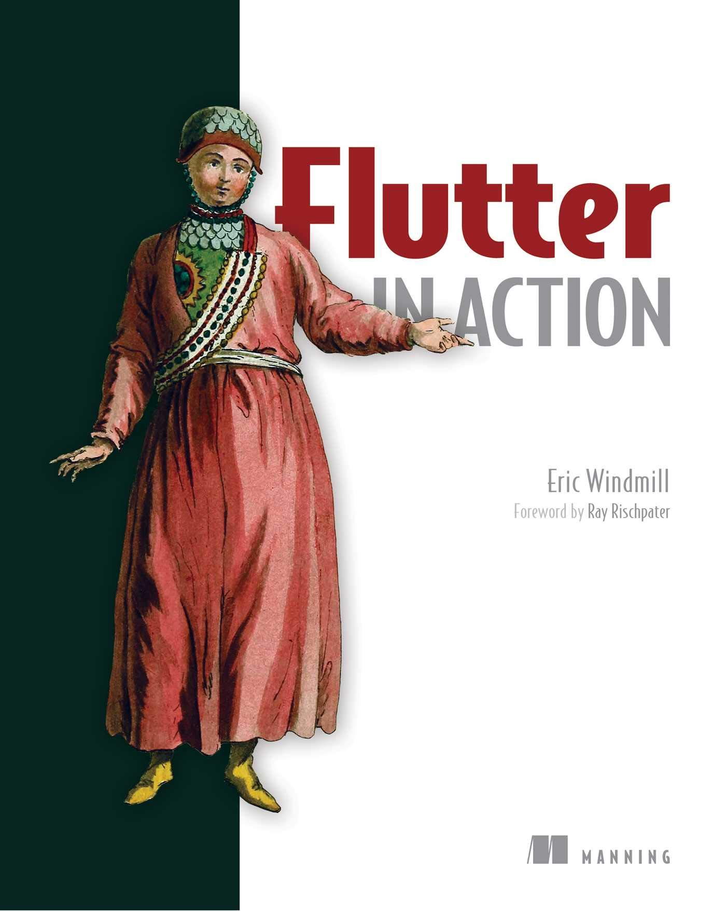

<h1 align="center">Desenvolvimento Mobile</h1>

<h4 align="center">Prof. Eduardo Ono</h4>

&nbsp;

## Descrição

&nbsp;

## Conteúdo Programático

| Aula | Data | Conteúdo |
| :-:  | ---  | ---      |
| 01 | 14/10 | Introdução ao Desenvolvimento Mobile; Fundamentos da linguagem Dart.
| 02 | 21/10 | Flutter SDK; Configuração do ambiente de desenvolvimento; "Olá Mundo!" em Flutter.
| 03 | 28/10 | Framework Flutter, Widgets, StatelessWidget e StatefullWidget.
| 04 | 04/11 | Documentação do Flutter, [Aplicativo IMC].
| 05 | 11/11 | [Estruturas de diretórios de um projeto Flutter]; [Comentários sobre padrões arquiteturais]; Telas; [Rotas nomeadas em uma aplicação Flutter]
| 06 | 18/11 | [Drawer, ListView, ListTile].
| 07 |  | "Jogo da Velha"
| 08 |  | Fundamentos de Jogos Digitais
| 09 |  | __2ª Avaliação__
| 10 |  | __Avaliação de 2a. Chamada¹__

¹Apenas para quem perdeu uma das Avaliações. É necessária solicitação junto à Secretaria.

[01]: ./aulas/README.md#aula-01
[02]: ./aulas/README.md#aula-02
[03]: ./aulas/README.md#aula-03
[04]: ./aulas/README.md#aula-04
[05]: ./aulas/README.md#aula-05
[06]: ./aulas/README.md#aula-06
[07]: https://github.com/eduardo-ono/Jogos-Digitais
[Aplicativo IMC]: ./conteudo/flutter/dartpad-exemplos/imc/README.md
[Estruturas de diretórios de um projeto Flutter]: ./conteudo/02-fundamentos/arquitetura-de-software/padroes-arquiteturais/README.md
[Comentários sobre padrões arquiteturais]: ./conteudo/02-fundamentos/arquitetura-de-software/padroes-arquiteturais/README.md
[Rotas nomeadas em uma aplicação Flutter]: ./conteudo/flutter/rotas/
[Drawer, ListView, ListTile]: ./conteudo/flutter/rotas/exemplos/drawer/
[Exemplos no DartPad]: ./conteudo/flutter/dartpad-exemplos/README.md

&nbsp;

## Pré-Requisitos

* [Introdução à Programação](https://github.com/eduardo-ono/Introducao-a-Programacao/)
* [Estrutura de Dados](https://github.com/eduardo-ono/Estrutura-de-Dados/)
* [Desenvolvimento Web](https://github.com/eduardo-ono/Desenvolvimento-Web/)
* [Programação Orientada a Objetos](https://github.com/eduardo-ono/Programacao-Orientada-a-Objetos/)

&nbsp;

## Recursos

* Android Studio
* Flutter SDK
* VS Code (Dart e Flutter)
* [DartPad](https://dartpad.dev/?null_safety=true)
* [Documentação do Flutter](https://docs.flutter.dev)

&nbsp;

## Bibliografia

| Capa | Descrição |
| :-:  | --- |
|  | [ZAMMETTI_2020] ZAMMETTI, Frank; __Flutter na Prática: Melhore seu Desenvolvimento Mobile com o SDK Open Source Mais Recente do Google__, Novatec Editora, 2020.
|  | [ZAMMETTI_2019]  ZAMMETTI, Frank; __Practical Flutter: Improve your Mobile Development with Google's Latest Open-Source SDK__, Apress, 2019[.](https://app.box.com/s/12e9ajfceiv9n29ojq81bqegrac87fp9)
|  | [BIESSEK_2019] BIESSEK, Alessandro; __Flutter for Beginners: An introductory guide to building cross-platform mobile applications with Flutter and Dart 2__, Birmingham: Packt Publishing, 2020[.](https://app.box.com/s/45ycchcwhei006mplhu924o5jwx1kq6o)

&nbsp;

## Bibliografia Complementar

| Capa | Descrição |
| :-:  | --- |
|  | [WINDMILL_2020] WINDMILL, Eric; __Flutter in Action__, Manning Publications, 2020.

&nbsp;

## Filmes e Documentários Recomendados

| Thumb | Descrição |
| :-:  | --- |
|  | [ENDEVR] [__The Mobile Revolution: How Cell Phones CHANGED our Lives Forever \| ENDEVR Documentary__](https://www.youtube.com/watch?v=Nwkn8kkqN94) (58:03, YouTube, Abr/2021)
|  | [Maestria nos Negócios] [__REVOLTANTE: Como o WhatsApp GANHA DINHEIRO?__](https://www.youtube.com/watch?v=SKG7BWvCKgI) (13:13, YouTube, Set/2022) |  

&nbsp;
