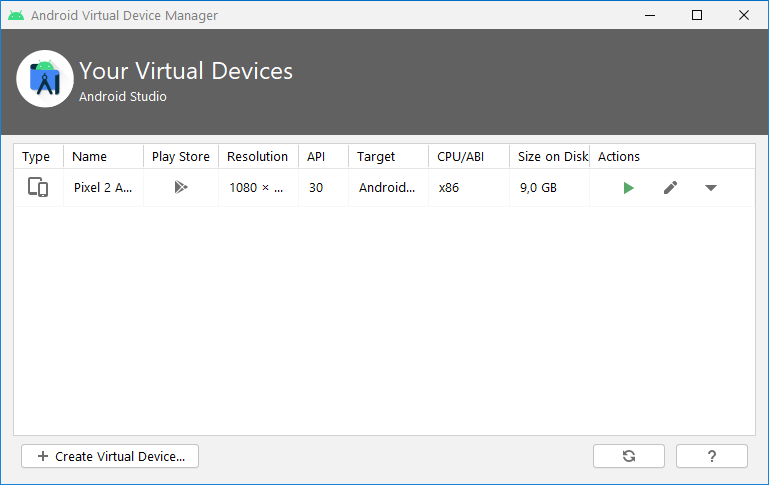

> Desenvolvimento Mobile > Conteúdo > Ambiente de Desenvolvimento

# Android Studio

Prof. Eduardo Ono

<br>

## Descrição

Tutorial para a instalação do Android Studio e configuração do Emulador Android nos ambientes Microsoft Windows 10 e Linux (Ubuntu).

<br>

## Requisitos de Hardware

* Processador com tecnologia de virtualização. A tecnologia de virtualização deve estar habilitada na BIOS.

  * Intel: VT-X
  * AMD: AMD-V

* Para verificar se a tecnologia de virtualização está habilitada:

  * Windows: Verificar no Gerenciador de Tarefas ou, no terminal do Windows, digitar:

    ```bat
    systeminfo
    ```

    Verifique se as opções em "Requisitos do Hyper-V" estão todas com "Sim/Yes".

  Na BIOS, a opção para ativar/desativar a tecnologia de virtualização pode ter vários nomes diferentes: 'Virtualization', etc...

* Recomendações

  * Pelo menos 8 GB de RAM

  * Armazenamento SSD

<br>

## Instalação do Android Studio no Windows

* Site do desenvolvedor:

  * https://developer.android.com/studio

* Erros/problemas que podem ocorrer na instalação:

  * [Como corrigir erros no Android Studio?](https://areatechbrasil.com.br/como-corrigir-erros-no-android-studio/)

* Vídeos de Apoio

  | Thumb | Descrição |
  | :-: | --- |
  | [](https://www.youtube.com/watch?v=PZMgUGcWXPc) | <sup>[Área Tech Brasil]</sup><br>[__NOVO ANDROID STUDIO - GUIA OFICIAL DE INSTALAÇÃO__](https://www.youtube.com/watch?v=PZMgUGcWXPc)<br><sub>(11:11, YouTube, Ago/2022)</sub>
  | [](https://www.youtube.com/watch?v=DCsaipE4OPw) | [__Android Studio Installation With SDK__](https://www.youtube.com/watch?v=DCsaipE4OPw)<br><sub>(12:34, YouTube, Ago/2021)</sub>
  | Erros no Android Studio
  | [](https://www.youtube.com/watch?v=ECIz_FnwuoI) | <sup>[Área Tech Brasil]</sup><br>[__Como Corrigir Erros no Android Studio?__](https://www.youtube.com/watch?v=ECIz_FnwuoI)<br><sub>(1:08:30, YouTube, Out/2020)</sub>
  | Dicas
  | [](https://www.youtube.com/watch?v=hYyS6ptcs9k "Android Studio não roda no meu computador \|\| 13:22, YouTube, Jul/2020")

<br>

## Instalação do Android Studio no Ubuntu

* Verificar se a tecnologia de virtualização KVM (Kernel-based Virtual Machine) está instalada para processador Intel ou AMD:

* https://linuxize.com/post/how-to-install-kvm-on-ubuntu-20-04/

* https://developer.android.com/studio/run/emulator-acceleration?utm_source=android-studio#vm-linux

* No Terminal, digitar o comando:

  ```bash
  sudo snap install android-studio --classic
  ```
* Para atualizar o Android Studio

  ```bash
  sudo snap refresh android-studio --classic 
  ```

* Vídeos de Apoio

  | [](https://www.youtube.com/watch?v=x3nVHXv3oyw "[ProgrammingKnowledge] How to Install Android Studio on Ubuntu 20.04 LTS \|\| 13:02, YouTube, Fev/2021")
  | ---

* Para remover o Android Studio:

  ```bash
  sudo snap remove android-studio --classic 
  ```

<br>

## Configuração do Android SDK no Android Studio

* Na janela de abertura do Android Studio, clicar em `Configure` e selecionar `SDK Manager`. Configurar o Android SDK conforme as capturas:

  
  

## Configuração de um Emulador Android no Android Studio

* Na janela de abertura do Android Studio, clicar em 'Configure' e selecionar 'AVD Manager'. Configurar o Android Virtual Devices conforme figura:

  

* Vídeos de Apoio

  | Instação e configuração do Emulador Android |
  | --- |
  | [](https://www.youtube.com/watch?v=YAkH6DcmbOY "[Tiago Aguiar] Emulador Android Como Instalar \|\| 7:34, YouTube, Mar/2020") - [](https://www.youtube.com/watch?v=TXRBT8kXPW0 "[Área Tech Brasil] ANDROID STUDIO 4.1 - COMO CRIAR UM EMULADOR (2021) \|\| 14:50, YouTube, Mar/2021")

<br>

## Configuração um SmartPhone Android (físico) para execução de aplicativos em desenvolvimento

* Vídeos de Apoio

  | [](https://www.youtube.com/watch?v=gErGLc4LDFQ "[Área Tech Brasil] Como Executar seus Aplicativos no Celular Android (O Guia definitivo) \|\| 5:08, YouTube, Mar/2021")
  | --- |

* https://www.youtube.com/watch?v=uF5rP2USP7A

<br>
