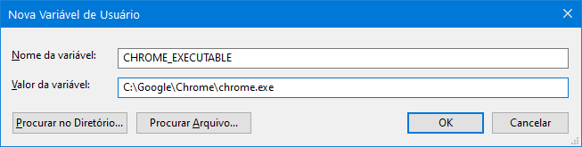

<table>
<tr>
<td align="left" width="8000">
  <small>Desenvolvimento Mobile</small>
</td>
<td align="right">
  <small>Atualizado&nbsp;em:&nbsp;21/04/2022</small>
</td>
</tr>
</table>

<br>

<h1 align="center">
Flutter - Ambiente de Desenvolvimento
</h1>
<h4 align="center">
Prof. Eduardo Ono
</h4>

<br>

## Descrição

...

<br>

## Flutter Mobile (Android)

Há várias opções de Ambientes de Desenvolvimento para o Flutter:

  1. Android Studio + Flutter SDK
  1. Android Studio + Visual Studio Code + Flutter SDK
  1. DartPad - https://dartpad.dev/flutter?null_safety=true

## Opção 1: Android Studio + Flutter SDK

* [x] Instalar o Android Studio com as opções _default_
* [x] Configurar o Android SDK
* [x] Configurar um Emulador Android
* [ ] Instalar os plugins Dart e Flutter no Android Studio
* [ ] Instalar o Flutter SDK

  OBS.: As opções marcadas estão abordadas em [Ambiente de Desenvolvimento](../../02-ambiente-de-desenvolvimento/).

## Opção 2: Android Studio + Visual Studio Code + Flutter SDK

* [ ] Instalar e configurar o Android Studio conforme a Opção 1
* [ ] Instalar o Visual Studio Code (VS Code)
* [ ] Instalar a extensão Flutter [Dart Code] no VS Code
* [ ] Instalar o Flutter SDK

## Instalação do Flutter SDK

* Site do desenvolvedor:

  * https://flutter.dev/docs/get-started/install/

### Windows

* Baixar o arquivo .zip (~900 MB) e descompacar o arquivo em um diretório de sua preferência, por exemplo, `C:\src` ou `C:\`. Será criado o sub-diretório `flutter`.

  OBS.: __Não__ instalar (descompactar) o flutter em um diretório que requer privilégios elevados, por exemplo, `C:\Arquivos de Programas`.

* Adicionar o diretório `<path_inicial>\flutter\bin` na variável de ambiente `PATH` do Windows.

#### Configurando Variáveis de Ambiente no Windows

  * Na janela de pesquisa do Windows, digitar _variáveis_.
    * Para adicionar uma variável de usuário, escolher a opção "Editar as variáveis de ambiente para sua conta".
    * Para editar uma variável de sistema , escolher 'Editar as variáveis de ambiente do sistema'. Também é possível abrir a janela 'Propriedades do Sistema' digitando-se `sysdm.cpl` na janela 'Executar'. Na aba 'Avançado', clicar em 'Variáveis de Ambiente'.
    * Na janela 'Variáveis de Ambiente', selecionar a variável `PATH` e clicar em 'Editar' para adicionar o path do Flutter.

### Windows 11 WSL

* https://www.youtube.com/watch?v=DnASqA7HkGc

* https://www.youtube.com/watch?v=nzEtYWZPnmc

* https://www.youtube.com/watch?v=h54nNuVAeWg

<br>

### Linux (Ubuntu)

* No Terminal, digitar os comandos:

  ```sh
  sudo apt update && sudo apt upgrade
  sudo snap install flutter --classic
  ```

### Mac

| Thumb | Descrição |
| :-: | --- |
|  | <sup>[Rodrigo Rahman]</sup> [__Curso de Flutter - Aula 1 Configurando seu ambiente de desenvolvimento para o flutter__](https://www.youtube.com/watch?v=qt20g3zuVbA) <br> <sub>(44:01, YouTube, Ago/2020)</sub>

<br>

## Comandos do Flutter

* Verificar a versão instalada:

```sh
flutter --version

```

* Desabilitar o Google Analytics:

```sh
flutter config --no-analytics
```

* Verificar se todos os [requisitos para execução do flutter](./figuras/flutter-doctor-erros.png) estão instalados:

```sh
flutter doctor
```

* Para __atualizar__ o Flutter:

```
flutter upgrade
```

<br>

## Flutter Web

  * [ ] Instalar o navegador Google Chrome
  * [ ] Se necessário, adicionar a variável de ambiente `CHROME_EXECUTABLE`, cujo valor é o executável `<path>\chrome.exe`:

    

  * Para listar os dispositivos reconhecidos pelo Flutter:

    ```sh
    flutter devices
    ```

  ### Configurando Variáveis de Ambiente no Linux/Bash

  ...

<br>

## Fluter Desktop (beta)

### Windows

* https://flutter.dev/docs/get-started/install/windows#windows-setup

### Ubuntu (Linux)

* https://flutter.dev/docs/get-started/install/linux#linux-setup

<br>

## Dart Code

* https://medium.com/flutter/how-to-embed-a-flutter-application-in-a-website-using-dartpad-b8fd0ee8c4b9

<br>
