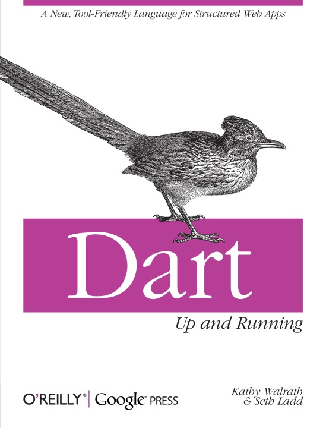

> <h5>Desenvolvimento Mobile > Conteúdo</h5>

# Dart

Prof. Eduardo Ono

 

## Tópicos

* ### [Overview](./00-overview)

* ### [Ambiente de Desenvolvimento](./01-ambiente-de-desenvolvimento)

* ### [Fundamentos da Linguagem](./02-fundamentos)

* ### [Orientação a Objetos](./03-poo)

* ### [Estrutura de Dados](./04-estrutura-de-dados)

 

## Recursos

* [https://dart.dev/guides](https://dart.dev/guides)

* https://www.tutorialspoint.com/dart_programming/index.htm

 

## Bibliografia Básica

| Capa | Descrição |
| :-: | --- |
|  | [WALRATH_2012] WALRATH, Kathy; LADD Seth. __Dart - Up and Running__, Sebastopol: O'Reilly Media, 2012[.](https://app.box.com/s/kmlb0pnjjs5xh9qlt3mtzo0ffggwu5ld)

 

## Bibliografia Complementar

| Capa | Descrição |
| :-: | --- |
|  | [BIESSEK_2019]  BIESSEK, Alessandro; __Flutter for Beginners: An introductory guide to building cross-platform mobile applications with Flutter and Dart 2__, Birmingham: Packt Publishing, 2020.

 
