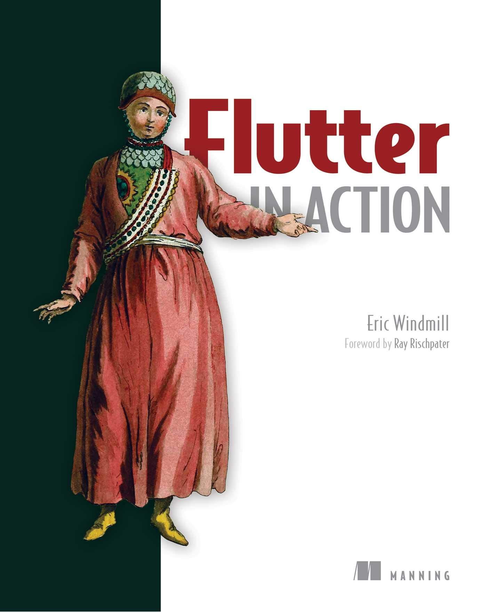

### Desenvolvimento Mobile

# Flutter

Prof. Eduardo Ono

<br>

## Sumário

* ### Overview
* ### Documentação
* ### Ambiente de Desenvolvimento
* ### Primeiros Passos com Flutter
* ### Programação

<br>

## Documentação

* [https://flutter.dev/docs](https://flutter.dev/docs)
* [https://api.flutter.dev](https://api.flutter.dev)
* Icons: [https://api.flutter.dev/flutter/material/Icons-class.html](https://api.flutter.dev/flutter/material/Icons-class.html)

<br>

### Ambiente Online

* [https://dartpad.dev/flutter](https://dartpad.dev/flutter)

<br>

### Requisitos de Hardware

* Consulte [aqui](../../ambiente-de-desenvolvimento/).

### Requisitos de Software

* Windows 10 64-bit
* Git
* Android Studio
* Visual Studio Code + Extensões

<br>

## Utilizando o Flutter

 * Para criar um novo projeto, mudar para o diretório onde será criado o projeto e digitar:

 ```
 flutter create [--org <br.com.dominio>] <nome_do_projeto>
 ```

 `br.com.dominio` é o endereço de sua empresa (pode ser fictícia) na ordem contrária.

  Exemplo:

 ```
 flutter create --org br.com.umbrella projeto_01
 ```

 Será criado um sub-diretório com o nome `nome_do_projeto`.
 Caso não seja utilizado o parâmetro `--org`, será utilizado um nome de domínio padrão.

### Desenvolvendo um projeto Flutter no VS Code

* Instalar a extensão `Flutter` (Dark Code).

* Para executar um projeto, teclar `Ctrl+F5` (Run Without Debugging)

* Para "resetar" um projeto, executar os comandos:

 ```
 flutter clean
 flutter packages get
 ```

<br>

## Fundamentos

* [RetroPortal Studio] [Top 10 Must Know Widgets In Detail for Flutter Developers - Flutter Tutorial](https://www.youtube.com/watch?v=x1LHDKLDT38) (YouTube, 1:09:12, Abr/2020)

<br>

## Vídeos Recomendados

* [Academind] [Flutter Crash Course for Beginners 2020 - Build a Flutter App with Google's Flutter & Dart](https://www.youtube.com/watch?v=x0uinJvhNxI) (YouTube, 5:44:31, 2019)

<br>

## Canais do YouTube Recomendados

* [Rodrigo Rahman](https://www.youtube.com/channel/UC5hvPObwya8kzWWB-wmVlXg)
* [Renato Mota](https://www.youtube.com/channel/UCd-vLa_qcKve3CsDFlYiygA)

<br>

## Bibliografia

| Capa | Descrição |
| :-:  | --- |
|  | [ZAMMETTI_2019]<br><br>ZAMMETTI, Frank; **Practical Flutter - Improve your Mobile Development with Google's Latest Open-Source SDK**, Apress, 2019[.](https://app.box.com/s/12e9ajfceiv9n29ojq81bqegrac87fp9)
|  | [ZAMMETTI_2020]<br><br>ZAMMETTI, Frank; **Flutter na Prática: Melhore seu Desenvolvimento Mobile com o SDK Open Source Mais Recente do Google**, Novatec Editora, 2020.
|  | [WINDMILL_2020]<br><br>WINDMILL, Eric. **Flutter in Action**, Manning Publications, 2020.

<br>
