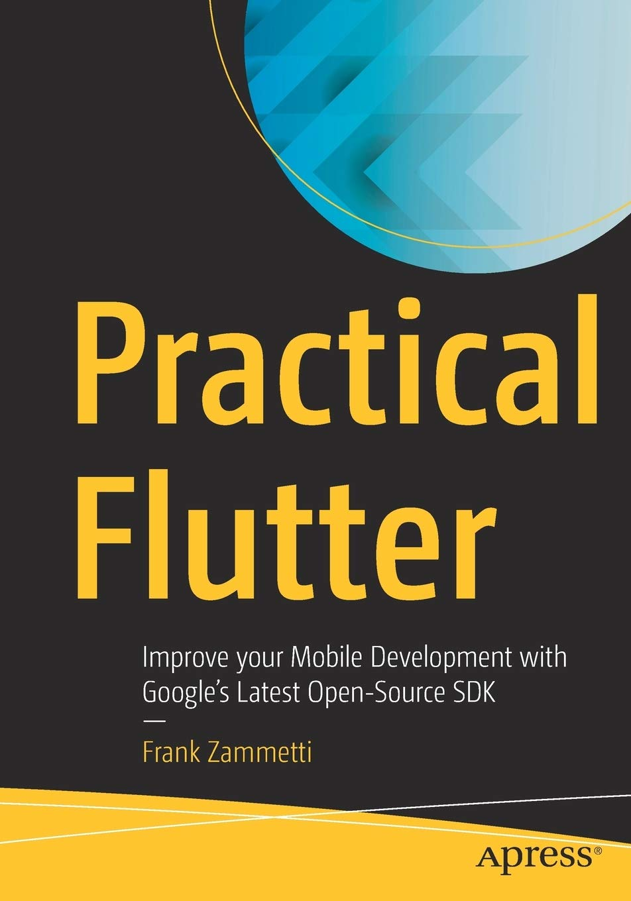

> <h5>Desenvolvimento Mobile > Conteúdo</h5>

# Flutter

Prof. Eduardo Ono

<br>

## Tópicos

* ### [Overview](./00-overview)

* ### [Ambiente de Desenvolvimento](./01-ambiente-de-desenvolvimento/README.md)

* ### Utilização do Flutter

* ### [Fundamentos do Framework](./fundamentos)

* ### Exemplos no Dartpad

* ### [Exemplos](./exemplos)

<br>

## Novidades

| Thumb | Descrição |
| :-: | --- |
| [](https://www.youtube.com/watch?v=Qi4C0ZroTm0) | <sup>[Rodrigo Rahman]</sup><br>[__Flutter 3 Novidades - DEVO ATUALIZAR???__](https://www.youtube.com/watch?v=Qi4C0ZroTm0)<br><sub>(16:28, YouTube, Mai/2022)</sub>
| [](https://www.youtube.com/watch?v=d-F14QrwM2A) | <sup>[Prof. Diego Antunes]</sup><br>[__Flutter 3 - Novidades e Material 3__](https://www.youtube.com/watch?v=d-F14QrwM2A)<br><sub>(13:56, YouTube, Mai/2022)</sub>

<br>

## Documentação

* [https://flutter.dev/docs](https://flutter.dev/docs)

* [https://api.flutter.dev](https://api.flutter.dev)

* Icons: [https://api.flutter.dev/flutter/material/Icons-class.html](https://api.flutter.dev/flutter/material/Icons-class.html)

<br>

## Recursos

* https://api.flutter.dev/flutter/material/Icons-class.html
* https://github.com/iampawan/FlutterExampleApps
* https://github.com/Solido/awesome-flutter
* https://github.com/nisrulz/flutter-examples
* https://github.com/Solido/awesome-flutter
* https://github.com/londonappbrewery/Flutter-Course-Resources
* https://medium.com/flutter-community/flutter-layout-cheat-sheet-5363348d037e
* https://www.codetime.dev.br/flutter-layout-cheat-sheet-0001/
* https://medium.com/flutter-community/flutter-animations-cheat-sheet-7f8cebfb850c
* https://github.com/PoojaB26/FlutterBasicWidgets

<br>

### Ambiente Online

* [https://dartpad.dev/flutter](https://dartpad.dev/flutter)

<br>

### Requisitos de Hardware

* Consulte [aqui](../../ambiente-de-desenvolvimento/).

### Requisitos de Software

* Windows 10 64-bit
* Git
* Android Studio
* Visual Studio Code + Extensões

<br>

## Utilizando o Flutter

* Para criar um novo projeto, mudar para o diretório onde será criado o projeto e digitar:

  ```
  flutter create [--org <br.com.dominio>] <nome_do_projeto>
  ```

  `br.com.dominio` é o endereço de sua empresa (pode ser fictícia) na ordem contrária.

  Exemplo:

  ```
  flutter create --org br.com.umbrella covid_x
  ```

 Será criado um sub-diretório com o nome `nome_do_projeto`.
 Caso não seja utilizado o parâmetro `--org`, será utilizado um nome de domínio padrão.

### Desenvolvendo um projeto Flutter no VS Code

* Instalar a extensão `Flutter` (Dark Code) no VS Code.

* Para executar um projeto, teclar <kbd>Ctrl</kbd> + <kbd>F5</kbd> (Run Without Debugging)

* Para "resetar" um projeto, executar os comandos:

  ```
  flutter clean
  flutter packages get
  ```

<br>

## Canais do YouTube Recomendados

* [Rodrigo Rahman](https://www.youtube.com/channel/UC5hvPObwya8kzWWB-wmVlXg)
* [Renato Mota](https://www.youtube.com/channel/UCd-vLa_qcKve3CsDFlYiygA)

<br>

## Bibliografia

| Capa | Descrição |
| :-:  | --- |
|  | <sup>[ZAMMETTI_2019]</sup><br>ZAMMETTI, Frank; __Practical Flutter - Improve your Mobile Development with Google's Latest Open-Source SDK__, Apress, 2019[.](https://app.box.com/s/12e9ajfceiv9n29ojq81bqegrac87fp9)
|  | <sup>[ZAMMETTI_2020]</sup><br>ZAMMETTI, Frank; __Flutter na Prática: Melhore seu Desenvolvimento Mobile com o SDK Open Source Mais Recente do Google__, Novatec Editora, 2020.
|  | <sup>[WINDMILL_2020]</sup><br>WINDMILL, Eric. __Flutter in Action__, Manning Publications, 2020.

<br>
