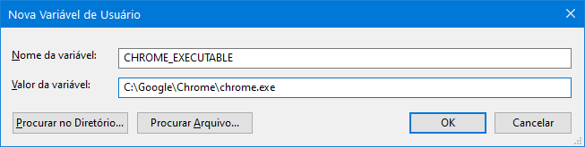

> ### Desenvolvimento Mobile

# Flutter > Ambiente de Desenvolvimento

Prof. Eduardo Ono

 

## Descrição

 

Há várias opções de Ambientes de Desenvolvimento para o Flutter:

  1. Android Studio + Flutter SDK
  1. Android Studio + Visual Studio Code + Flutter SDK
  1. DartPad - https://dartpad.dev/flutter?null_safety=true

## Ambiente 1: Android Studio + Flutter SDK

* [x] Instalar o Android Studio com as opções _default_
* [x] Configurar o Android SDK
* [x] Configurar um Emulador Android
* [ ] Instalar os plugins Dart e Flutter no Android Studio
* [ ] Instalar o Flutter SDK

  OBS.: As opções marcadas estão abordadas em [Ambiente de Desenvolvimento](../../02-ambiente-de-desenvolvimento/).

## Ambiente 2: Android Studio + Visual Studio Code + Flutter SDK

* [ ] Instalar e configurar o Android Studio conforme o Ambiente 1
* [ ] Instalar o Visual Studio Code (VS Code)
* [ ] Instalar a extensão Flutter [Dart Code] no VS Code
* [ ] Instalar o Flutter SDK

## Configurando Variáveis de Ambiente no Windows

* Na janela de pesquisa do Windows, digitar _variáveis_.
  *  Para adicionar uma variável de usuário, escolher a opção 'Editar as variáveis de ambiente para sua conta'.
  *  Para adicionar uma variável de sistema , escolher 'Editar as variáveis de ambiente do sistema'. Também é possível abrir a janela 'Propriedades do Sistema' digitando-se `sysdm.cpl` na janela 'Executar'. Na aba 'Avançado', clicar em 'Variáveis de Ambiente'.
    * Na janela 'Variáveis de Ambiente', clicar em 'Novo' para adicionar uma nova variável ou 'Editar' para editar uma variável já existente (deve estar selecionada).

## Flutter Web

  * [ ] Instalar o navegador Google Chrome
  * [ ] Se necessário, adicionar a variável de ambiente `CHROME_EXECUTABLE`, cujo valor é o executável `path\chrome.exe`:

    

  ### Configurando Variáveis de Ambiente no Linux/Bash

 
